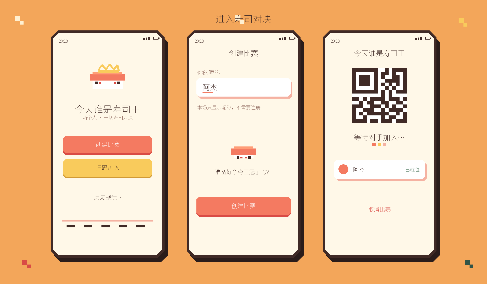
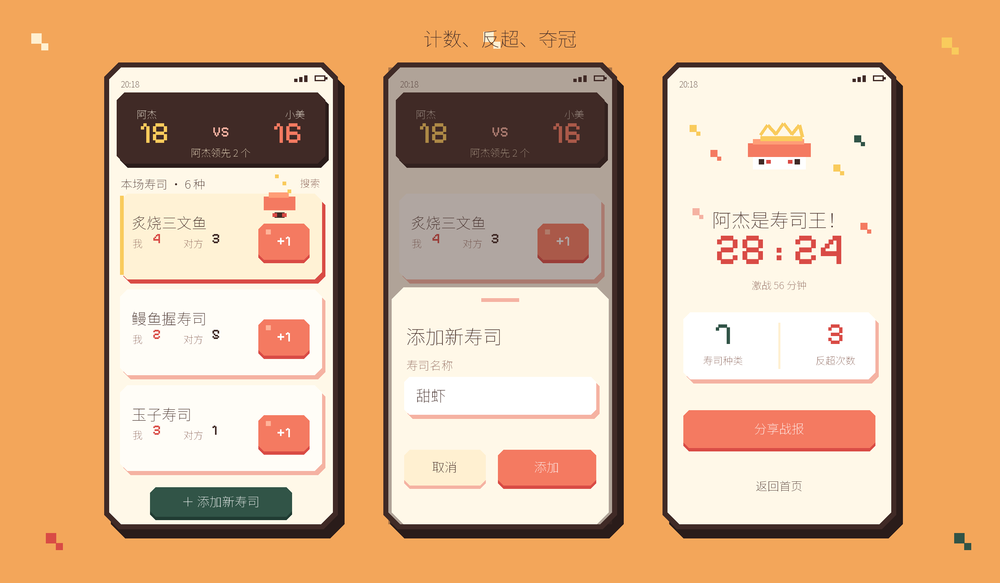
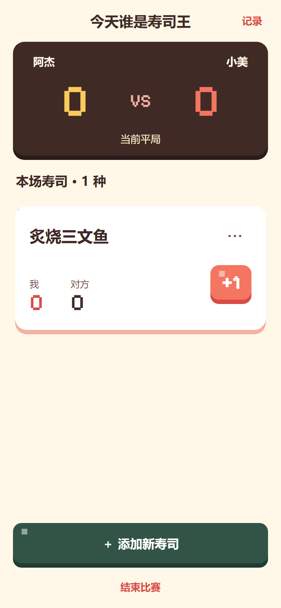
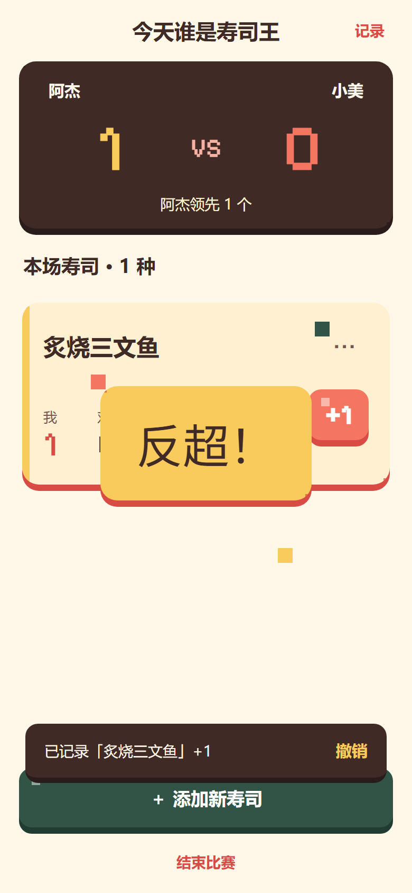
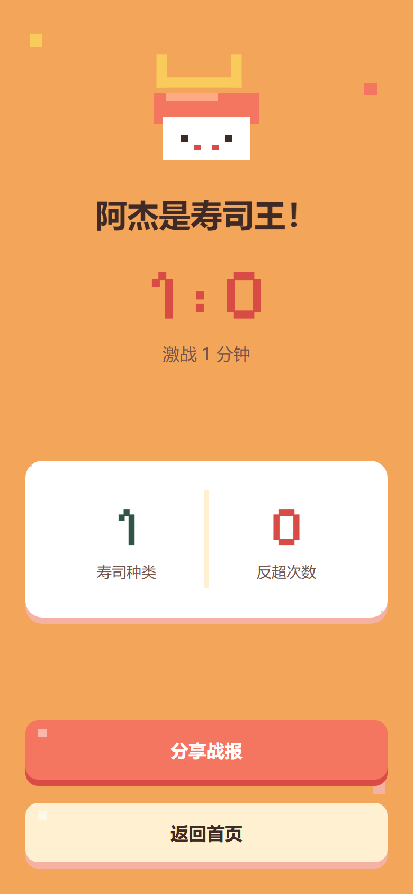

<p align="center">
  
</p>

<h1 align="center">寿司王</h1>

<p align="center">
  两个人，一场寿司对决。边吃边记，实时争夺寿司王。
</p>

<p align="center">
  <a href="https://autopoet.github.io/free_race/">打开寿司王网页版</a>
  ·
  <a href="./PRD.md">产品需求</a>
  ·
  <a href="./DESIGN.md">视觉设计</a>
</p>

<p align="center">
  <a href="https://github.com/autopoet/free_race/releases/download/v1.0.0/sushi-king-1.0.0-arm64-release.apk">
    
  </a>
  <br />
  <strong>v1.0.0 · ARM64 · 约 39.5 MB · Android 7.0+</strong>
  <br />
  <sub>已完成荣耀手机真机安装与启动验证 · <a href="https://github.com/autopoet/free_race/releases/tag/v1.0.0">查看版本说明</a></sub>
</p>

「寿司王」是一款使用 Expo React Native 构建的 iOS / Android 跨端寿司计数对战应用。无需注册账号，两个人到餐厅后即可临时创建比赛，通过二维码加入同一房间，共享寿司菜单和实时比分。

## 设计预览

从创建比赛、扫码入场，到共享寿司菜单、计数和冠军结算，整体采用暖色调的可爱像素风格。





### 实际页面

<p align="center">
  
  
  
</p>

## 使用方法

### iPhone：免费添加到主屏幕

1. 使用 Safari 打开 [寿司王网页版](https://autopoet.github.io/free_race/)。
2. 点击 Safari 的“分享”按钮，选择“添加到主屏幕”。
3. 打开“作为网页 App 打开”，然后点击“添加”。
4. 从 iPhone 桌面打开「寿司王」，首次扫码时允许使用相机。

如果链接是从微信打开的，请先通过右上角菜单选择“在 Safari 中打开”。这种方式不需要 Apple Developer 账号，也不需要从 App Store 下载。

### Android：下载安装包

1. 点击上方醒目的“Android APK 立即下载”按钮，或[直接下载寿司王 v1.0.0 APK](https://github.com/autopoet/free_race/releases/download/v1.0.0/sushi-king-1.0.0-arm64-release.apk)。
2. 点击 APK 安装；如果系统提示，请允许当前文件管理器“安装未知应用”。
3. 安装完成后从桌面打开「寿司王」，并允许扫码所需的相机权限。

Android 也可以直接打开[网页版](https://autopoet.github.io/free_race/)使用。

### 开始一场比赛

1. 创建者点击“创建比赛”，填写自己的昵称。
2. 创建成功后，将比赛二维码展示给另一位玩家。
3. 加入者点击“扫码加入”，扫描二维码并填写自己的昵称。
4. 两个人到齐后比赛自动开始。
5. 第一次吃到某种寿司时，点击“添加新寿司”并填写一个容易辨认的名称，例如“炙烧三文鱼”或“黄色那个”。
6. 寿司名称会成为双方共享菜单；之后每吃一个，就在自己的手机上点击对应寿司的 `+1`。
7. 误点可以立即撤销，也可以打开寿司菜单进行修正。
8. 吃完后发起结束比赛，双方确认后进入冠军结算页。

> 两台手机需要联网。比分、共享菜单和计数记录通过 Supabase 实时同步。

## 当前实现

- 无账号创建比赛与昵称输入
- 二维码展示、扫码加入和网页邀请链接
- 两人到齐后自动开始比赛
- 玩家自定义并复用共享寿司名称
- 独立悬浮寿司卡片、自己计数、修正和即时撤销
- 双机共享菜单、计数事件与比分实时同步
- 服务端事件幂等、成员级 RLS 和双方结束确认
- 冠军结算、系统分享和本地历史
- AsyncStorage 本地恢复
- iOS / Android 安全区、触觉与减少动态效果适配

未配置云端时，应用会自动使用本机演示模式，等待页提供“本机演示：模拟对手加入”，便于单机体验完整流程。完整云端配置见 [Supabase 配置说明](./docs/SUPABASE_SETUP.md)。

## 本地开发

```bash
npm install
npm run android
```

其他目标：

```bash
npm run ios
npm run web
```

Windows 无法直接运行本地 iOS 模拟器，可使用 Expo Go 在 iPhone 真机预览，或在 macOS 上运行 iOS 模拟器。Android 内测 APK 和其他构建命令见 [构建说明](./docs/BUILD.md)。

## 验证

```bash
npm run typecheck
npx expo-doctor
npm run build:web
```

当前验证范围包括 TypeScript 类型检查、Expo Doctor、Web 正式导出以及浏览器端主流程测试。

## 项目结构

```text
src/
  components/   像素按钮、硬阴影表面、比分板和寿司签
  hooks/        减少动态效果等跨端能力
  navigation/   页面路由类型
  screens/      创建、扫码、比赛、结算和历史页面
  services/     Supabase 匿名认证、RPC、快照与实时订阅
  store/        比赛状态与本地持久化
  theme/        颜色、尺寸和动效令牌
  types/        比赛领域模型
design/         视觉原型与运行截图
supabase/       数据库迁移、RLS 与服务端 RPC
docs/           云端配置和双端构建说明
```
